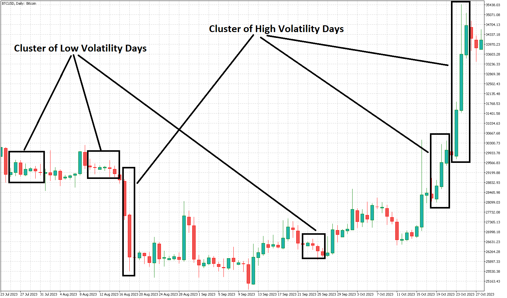

# Other Examples: Markov Chain to Determine Market Risk
--- Part 3 ---

Previous Section (part 1): [Basic Understanding of Markov Chain in Financial Market](https://github.com/handiko/Markov-Chain-In-Financial-Market/blob/main/README.md)

Previous Section (part 2): [Using Markov chain to analyze first insight of a forex pair, index, or any market](https://github.com/handiko/Markov-Chain-UpDown-Day/blob/main/README.md)

---

Other than the market directionality, like in the previous section, in this article, I'd like to measure the market risk in terms of volatility using Markov chain analysis. Instead of an up or down day, we'll see a sequence of High or Low volatility days preceding a High or Low volatility day.

## Basic Understanding of Market Volatility
My definition of market volatility is as simple as: **"How large is the distance between the high of the day and the low of the day?"**. In other words, volatility is **the price range of the day**. (at least in my definition).
It could be measured in percent, pips, standard deviation, or any units that are suitable for each case.
The definition of today's volatility used in this article is **"the price distance between the high of the day and the low of the day, compared to the open price of the day, measured in percent"**.

$$
V = 100 \frac{{P_H - P_L}}{P_O}
$$

The understanding of market volatility is mostly used in terms of risk assessment. A high volatility day could make the running trade go haywire, as the wild price movement could trigger the stop loss and reverse back to the previous profitable price area (a price whipsaw). In this case, one can reduce the market exposure, move the stop loss into the profitable level (trailing stop), close the position, or use another trade management mechanism. For me personally, I'd like to trade in a low volatility environment as the price would likely move to either take profit or stop loss level smoothly.
Other trading strategies could be profitable on this highly volatile day instead. Therefore, volatility assessment could be used for a trading strategy filter or confirmation as well.

## High Order Markov Chain of Market Volatility
In this article, I use a sequence of **three preceding days** to analyze the next day's volatility probability. A high volatility day would be represented as an $H$, and a low volatility day would be represented as an $L$.
Therefore, the possible list of Markov chain transitions that could occur in this case is as follows:
* $LLL \to L$
* $LLL \to H$
* $LLH \to L$
* $LLH \to H$
* $LHL \to L$
* $LHL \to H$
* $LHH \to L$
* $LHH \to H$
* $HLL \to L$
* $HLL \to H$
* $HLH \to L$
* $HLH \to H$
* $HHL \to L$
* $HHL \to H$
* $HHH \to L$
* $HHH \to H$

16 possible cases could occur in the market.
As in the previous examples, we want to know the probability of each Markov chain transition as per the table below:
|                       | Next day is H | Next day is L |
|-----------------------|---------------|---------------|
| Previuos days are LLL |               |               |
| Previuos days are LLH |               |               |
| Previuos days are LHL |               |               |
| Previous days are LHH |               |               |
| Previous days are HLL |               |               |
| Previous days are HLH |               |               |
| Previous days are HHL |               |               |
| Previous days are HHH |               |               |

## MQL5 Code to Analyze the Markov Chain Transition Probability
In the [MQL5 folder](https://github.com/handiko/Other-Examples-Markov-Chain-In-Financial-Market-Risk/tree/main/MQL5%20Code) included in this article, I provided a simple use code that shows the use case of Markov Chain analysis to assess market volatility risk, by extracting the transition probability.
Also, as an example, I would use the code in the BTC-USD market (Bitcoin) as an example in this article.


Code: [Relative Volatility Study - 3 Candle.mq5](https://github.com/handiko/Other-Examples-Markov-Chain-In-Financial-Market-Risk/blob/main/MQL5%20Code/Relative%20Volatility%20Study%20-%203%20Candle.mq5)

Market: BTC-USD, Daily Timeframe

In the code, one can input the volatility threshold (in percent) that will be used to determine whether the evaluated day is either high or low volatility. As each market has different volatility characteristics, one should input the threshold for whatever suitable for them. In this example, I would use **5% as the threshold**. It means, if the daily range is below 5% relative to the open price, it would be categorized as a low volatility day $L$, otherwise, a high volatility day $H$.

MQL5 code snippets on this example: (spoiler, it is very similar to the previous example)
```mql5
input static ENUM_TIMEFRAMES InpTimeframe = PERIOD_D1;     // Timeframe
input double InpVolatilityThreshold = 1;                   // Volatility Threshold in Percent

#define PREVIOUS_CANDLE 3
#define CANDLE (PREVIOUS_CANDLE+1)
#define COMBINATIONS 16

struct Pattern {
     int       count;
     double    probability;
};

struct Price {
     double    o;
     double    h;
     double    l;
     double    pct_range;
};

Pattern pattern[COMBINATIONS];
Price price[CANDLE];

// ------------------

void OnTick() {
     int bars = iBars(_Symbol, InpTimeframe);
     int patt = 0;
     if(bars != totalBars) {
          totalBars = bars;

          for(int i = 0; i < CANDLE; i++) {
               price[i].h = iHigh(_Symbol, InpTimeframe, CANDLE - i);
               price[i].l = iLow(_Symbol, InpTimeframe, CANDLE - i);
               price[i].o = iOpen(_Symbol, InpTimeframe, CANDLE - i);

               price[i].pct_range = 100.0 * (price[i].h - price[i].l) / price[i].o;

               patt += ((price[i].pct_range > InpVolatilityThreshold ? 1 : 0) << (CANDLE - 1 - i));
          }

          CountPattern(pattern[patt]);
     }
}

```

The results are as follows:


The transition probability based on the results:

|                       | Next day is H | Next day is L |
|-----------------------|---------------|---------------|
| Previuos days are LLL | 0.2           | 0.8           |
| Previuos days are LLH | 0.35          | 0.65          |
| Previuos days are LHL | 0.31          | 0.69          |
| Previous days are LHH | 0.58          | 0.42          |
| Previous days are HLL | 0.28          | 0.72          |
| Previous days are HLH | 0.48          | 0.52          |
| Previous days are HHL | 0.49          | 0.51          |
| Previous days are HHH | 0.71          | 0.29          |

## Something Interesting About The Results
1. As we can see from the results above, basically, **the majority of the days in the BTC-USD market are low-volatility days** (less than 5% percent threshold), as most of the high probability transitions are in favor of the "Next day is L" column.

3. Another interesting result is, **two or more consecutive low-volatility days are highly likely to precede another low-volatility day, and two or more consecutive high-volatility days are highly likely to precede another high-volatility day** as well. These results describe a direct observation of **"Volatility Clustering"**, which is a phenomenon observed in financial markets where _periods of high volatility tend to be followed by periods of high volatility and low volatility is followed by low volatility_.

The volatility clustering phenomenon on the BTC-USD market can be observed visually on the following chart in the middle of 2023.



---
