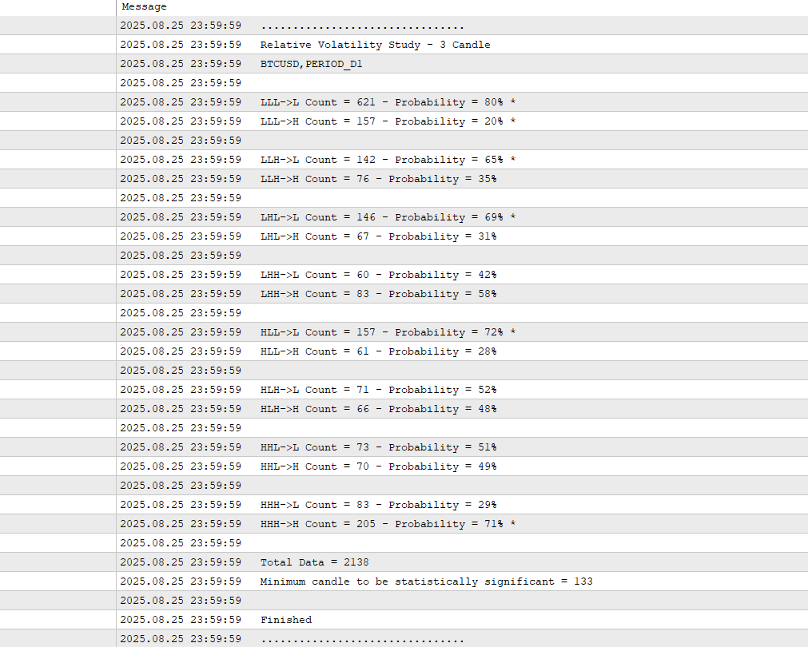

# Other Examples: Markov Chain to Determine Market Risk
--- Part 3 ---

Previous Section (part 1): [Basic Understanding of Markov Chain in Financial Market](https://github.com/handiko/Markov-Chain-In-Financial-Market/blob/main/README.md)

Previous Section (part 2): [Using Markov chain to analyze first insight of a forex pair, index, or any market](https://github.com/handiko/Markov-Chain-UpDown-Day/blob/main/README.md)

---

Building on our previous discussion of market directionality, this section introduces a new application of Markov chain analysis to measure market risk. By shifting our focus from directional movement (up or down days) to volatility, we can now analyze the sequences of high or low volatility days that precede similar volatility states.

## Basic Understanding of Market Volatility
In this analysis, market volatility is defined simply as the price range of the day. Specifically, it's the distance between the high and low of the day. This metric can be expressed in various units, such as percentages, pips, or standard deviations. For this article, today's relative volatility is measured as the percentage distance between the high and low of the day, relative to the open price.

$$
V_{R} = 100 \frac{{P_H - P_L}}{P_O}
$$

Understanding market volatility is essential for effective risk management. High volatility can lead to unpredictable price swings, increasing the risk of a trade going "haywire." This wild movement can trigger a stop loss, only for the price to reverse back to a previously profitable area—a phenomenon known as a price whipsaw. In such an environment, traders can use several risk management techniques, such as reducing market exposure, implementing a trailing stop, or closing the position entirely.
Personally, I prefer trading in low-volatility conditions, as price action tends to be smoother, allowing trades to more consistently reach their take-profit or stop-loss levels. However, there are other strategies specifically designed to capitalize on high-volatility environments. Ultimately, volatility assessment can serve as a crucial filter to determine which trading strategy is most suitable for a given market condition.

## High Order Markov Chain of Market Volatility
In this article, I use a sequence of **three preceding days** to analyze the next day's volatility probability. A high volatility day would be represented as an $H$, and a low volatility day would be represented as an $L$.
Therefore, the possible list of Markov chain transitions that could occur in this case is as follows:
* $LLL \to L$
* $LLL \to H$
* $LLH \to L$
* $LLH \to H$
* $LHL \to L$
* $LHL \to H$
* $LHH \to L$
* $LHH \to H$
* $HLL \to L$
* $HLL \to H$
* $HLH \to L$
* $HLH \to H$
* $HHL \to L$
* $HHL \to H$
* $HHH \to L$
* $HHH \to H$

16 possible cases could occur in the market.
As in the previous examples, we want to know the probability of each Markov chain transition as per the table below:
|                       | Next day is H | Next day is L |
|-----------------------|---------------|---------------|
| Previous days are LLL |               |               |
| Previous days are LLH |               |               |
| Previous days are LHL |               |               |
| Previous days are LHH |               |               |
| Previous days are HLL |               |               |
| Previous days are HLH |               |               |
| Previous days are HHL |               |               |
| Previous days are HHH |               |               |

## MQL5 Code to Analyze the Markov Chain Transition Probability
To demonstrate the application of Markov Chain analysis in assessing market volatility risk, I've included a sample MQL5 code in the [provided folder](https://github.com/handiko/Other-Examples-Markov-Chain-In-Financial-Market-Risk/tree/main/MQL5%20Code). This code extracts transition probabilities to give insight into market risk. For illustrative purposes, this article will use the Bitcoin (BTC-USD) market as a case study.

Code: [Relative Volatility Study - 3 Candle.mq5](https://github.com/handiko/Other-Examples-Markov-Chain-In-Financial-Market-Risk/blob/main/MQL5%20Code/Relative%20Volatility%20Study%20-%203%20Candle.mq5)

Market: BTC-USD, Daily Timeframe

The provided code allows for a user-defined volatility threshold (in percent) to classify each day as either high or low volatility. This threshold should be tailored to the specific characteristics of the market being analyzed. For this example, a 5% threshold is used. This means any day with a daily range below 5% of its opening price is categorized as a low-volatility day ($L$), while any day with a range of 5% or more is considered a high-volatility day ($H$).

MQL5 code snippets on this example: (spoiler, it is very similar to the previous example)
```mql5
input static ENUM_TIMEFRAMES InpTimeframe = PERIOD_D1;     // Timeframe
input double InpVolatilityThreshold = 1;                   // Volatility Threshold in Percent

#define PREVIOUS_CANDLE 3
#define CANDLE (PREVIOUS_CANDLE+1)
#define COMBINATIONS 16

struct Pattern {
     int       count;
     double    probability;
};

struct Price {
     double    o;
     double    h;
     double    l;
     double    pct_range;
};

Pattern pattern[COMBINATIONS];
Price price[CANDLE];

// ------------------

void OnTick() {
     int bars = iBars(_Symbol, InpTimeframe);
     int patt = 0;
     if(bars != totalBars) {
          totalBars = bars;

          for(int i = 0; i < CANDLE; i++) {
               price[i].h = iHigh(_Symbol, InpTimeframe, CANDLE - i);
               price[i].l = iLow(_Symbol, InpTimeframe, CANDLE - i);
               price[i].o = iOpen(_Symbol, InpTimeframe, CANDLE - i);

               price[i].pct_range = 100.0 * (price[i].h - price[i].l) / price[i].o;

               patt += ((price[i].pct_range > InpVolatilityThreshold ? 1 : 0) << (CANDLE - 1 - i));
          }

          CountPattern(pattern[patt]);
     }
}

```

The results are as follows:



The transition probability based on the results:

|                       | Next day is H | Next day is L |
|-----------------------|---------------|---------------|
| Previous days are LLL | 0.2           | 0.8           |
| Previous days are LLH | 0.35          | 0.65          |
| Previous days are LHL | 0.31          | 0.69          |
| Previous days are LHH | 0.58          | 0.42          |
| Previous days are HLL | 0.28          | 0.72          |
| Previous days are HLH | 0.48          | 0.52          |
| Previous days are HHL | 0.49          | 0.51          |
| Previous days are HHH | 0.71          | 0.29          |

## Something Interesting About The Results
1. From the results, it's clear that **the majority of days in the BTC-USD market are low-volatility days**, with a daily range below the 5% threshold. This is evidenced by the high probability transitions favoring the "Next day is L" column.
2. The results also directly illustrate the phenomenon of **"Volatility Clustering"**. We observe that two or more consecutive low-volatility days are highly likely to precede another low-volatility day. Conversely, two or more consecutive high-volatility days are also highly likely to be followed by another high-volatility day. This confirms that **periods of high volatility tend to be followed by more high volatility, and periods of low volatility are followed by low volatility**.
3. Further analysis reveals nuanced probabilities:
* If exactly one of the last three days was a low-volatility day, the probability of the next day being high-volatility is roughly 50%.
* If two of the last three days were low-volatility days (even if not consecutive), the probability of the next day also being low-volatility exceeds 65%.

The chart below visually demonstrates this volatility clustering in the BTC-USD market during the middle of 2023.


---

Next Section (part 4): [Trading Strategy Development Example](https://github.com/handiko/Trading-Strategy-Development-Example/blob/main/README.md)

Next Section (part 5): [Trading Strategy Improvement](https://github.com/handiko/Improvement-to-an-existing-strategy/blob/main/README.md)
